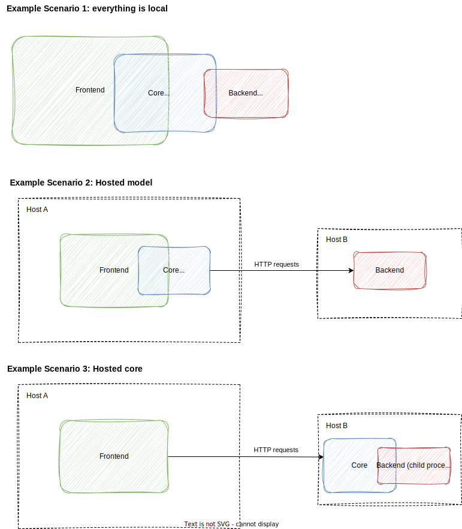

# llmvm

[](https://github.com/DJAndries/llmvm/blob/master/LICENSE)

A protocol and modular application suite for language models.

Includes a [code assistant](https://github.com/djandries/llmvm/tree/master/frontends/codeassist) that automatically retrieves context, powered by LSP.

## Overview

llmvm consists of three types of executable applications:

- [Frontends](https://github.com/djandries/llmvm/tree/master/frontends): specialized applications that use language models
- [The core](https://github.com/djandries/llmvm/tree/master/core): acts as middleman between frontend and backend; manages state related to text generation, such as:
  - Model presets
  - Prompt templates
  - Message threads
  - Projects/workspaces
- [Backends](https://github.com/djandries/llmvm/tree/master/backends): wrappers for language models, handles raw text generation requests

The [protocol](https://github.com/djandries/llmvm/tree/master/protocol) acts as the glue between the above applications. Uses [multilink](https://github.com/djandries/multilink) and [tower](https://github.com/tower-rs/tower) to achieve this.

### Available crates

- Frontends
  - [codeassist](https://github.com/djandries/llmvm/tree/master/frontends/codeassist): A LLM-powered code assistant that automatically retrieves context (i.e. type definitions) from a Language Server Protocol server
  - [chat](https://github.com/djandries/llmvm/tree/master/frontends/chat): A CLI chat interface
- [Core](https://github.com/djandries/llmvm/tree/master/core)
- Backends
  - [outsource](https://github.com/djandries/llmvm/tree/master/backends/outsource): Forwards generation requests to known hosted language model providers such as OpenAI, Anthropic, Hugging Face and Ollama.
  - [llmrs](https://github.com/djandries/llmvm/tree/master/backends/llmrs): Uses the [llm](https://github.com/rustformers/llm) crate to process generation requests. Supported models include LLaMA, GPT-2, GPT-J and more.

### IPC details

Each component can interact with a dependency component via three methods:

- Local child process: the component invokes the dependency component as a child process, and communicates via stdio using JSON-RPC
- Remote HTTP service: the dependency component acts as a HTTP API, and the dependent component is configured to make web requests to the API
- Direct linking: The core and backends have library crates which can be used directly. Only works if dependent component is a Rust application.

This allows for some flexible hosting configurations. Here are some examples:



### Benefits

- Single protocol for state-managed text generation requests
- A frontend or backend can be implemented in any language, only requires a stdio and/or HTTP server/client to be available.
- Uses [Handlebars](https://handlebarsjs.com/) for prompt templates, allowing powerful prompt generation
- Saves message threads, presets and prompt templates on the filesystem for easy editing/tweaking
- Workspace / project management for isolating project state from global state
- Modular design; any component can by invoked by the user via CLI for a one-off low-level or high-level request.

## Installation

`cargo` is needed to install the binaries. Use [rustup](https://rustup.rs/) to install cargo.

Install the core by running:

```
cargo install llmvm-core
```

Install the desired frontends & backends listed under "Available crates". See their READMEs for more details.

## Usage / configuration

See the README of each relevant component for more information on usage and configuration.

## Model IDs

Model IDs in llmvm are strings consisting of three parts:

```
<backend name>/<provider name>/<model name>
```

The provider name must have the suffix `-chat` or `-text`

Examples:
- `outsource/openai-chat/gpt-3.5-turbo`
- `outsource/anthropic-chat/claude-3-5-sonnet-20240620`
- `llmrs/llmrs-text/mpt-7b-chat-q4_0-ggjt`

By default, the core will invoke the process `llmvm-<backend name>` for local process communication.

## Presets / Projects / Threads / Prompt Templates

See the [core README](https://github.com/djandries/llmvm/tree/master/core) for more information.

## Model weights

See the relevant backend README (i.e. [llmrs](https://github.com/djandries/llmvm/tree/master/backends/llmrs)).

## License

[Mozilla Public License, version 2.0](https://spdx.org/licenses/MPL-2.0.html)
